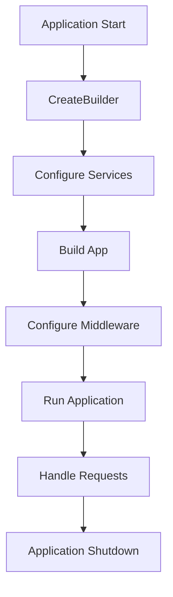

# ASP.NET Core Fundamentals Cheat Sheet

## 🚀 Quick Reference Guide

### Core Concepts

| Concept | Description | Key Points |
|---------|-------------|------------|
| **Host** | The container for the app | Configures services and request pipeline |
| **Middleware** | Components that handle requests | Executes in order, can short-circuit |
| **Services** | Dependencies registered in DI container | Scoped, Singleton, or Transient lifetime |
| **Configuration** | Settings from various sources | Hierarchical, environment-aware |
| **Routing** | Maps URLs to endpoints | Convention-based or attribute routing |

### Application Lifecycle



### Essential Program.cs Pattern

```csharp
// 1. Create builder
var builder = WebApplication.CreateBuilder(args);

// 2. Add services
builder.Services.AddRazorPages();
builder.Services.AddControllers();
builder.Services.AddScoped<IMyService, MyService>();

// 3. Build app
var app = builder.Build();

// 4. Configure middleware pipeline
if (app.Environment.IsDevelopment())
{
    app.UseDeveloperExceptionPage();
}
else
{
    app.UseExceptionHandler("/Error");
    app.UseHsts();
}

app.UseHttpsRedirection();
app.UseStaticFiles();
app.UseRouting();
app.UseAuthentication();
app.UseAuthorization();

// 5. Map endpoints
app.MapRazorPages();
app.MapControllers();

// 6. Run
app.Run();
```

### Service Lifetimes

| Lifetime | Usage | Instance Created |
|----------|-------|------------------|
| **Singleton** | `AddSingleton<T>()` | Once per application |
| **Scoped** | `AddScoped<T>()` | Once per request |
| **Transient** | `AddTransient<T>()` | Every time requested |

### Common Middleware (in typical order)

1. **Exception/Error Handling** → `UseExceptionHandler()` / `UseDeveloperExceptionPage()`
2. **HSTS** → `UseHsts()`
3. **HTTPS Redirection** → `UseHttpsRedirection()`
4. **Static Files** → `UseStaticFiles()`
5. **Routing** → `UseRouting()`
6. **CORS** → `UseCors()`
7. **Authentication** → `UseAuthentication()`
8. **Authorization** → `UseAuthorization()`
9. **Custom Middleware** → `UseMiddleware<T>()`
10. **Endpoints** → `UseEndpoints()` or `MapControllers()`/`MapRazorPages()`

### Configuration Sources (in priority order)

1. Command-line arguments
2. Environment variables
3. User secrets (Development only)
4. appsettings.{Environment}.json
5. appsettings.json
6. Default values

### Environments

| Environment | Purpose | Typical Use |
|-------------|---------|-------------|
| **Development** | Local development | Detailed errors, hot reload |
| **Staging** | Pre-production testing | Production-like, debug enabled |
| **Production** | Live environment | Optimized, minimal logging |

Set via `ASPNETCORE_ENVIRONMENT` environment variable.

### Dependency Injection Quick Reference

```csharp
// Register services
builder.Services.AddScoped<IEmailService, EmailService>();
builder.Services.AddSingleton<ICacheService, MemoryCacheService>();
builder.Services.AddTransient<ILogger, ConsoleLogger>();

// Inject in constructor
public class HomeController : Controller
{
    private readonly IEmailService _emailService;
    
    public HomeController(IEmailService emailService)
    {
        _emailService = emailService;
    }
}

// Inject in Razor Pages
public class IndexModel : PageModel
{
    private readonly IConfiguration _config;
    
    public IndexModel(IConfiguration config)
    {
        _config = config;
    }
}
```

### Razor Pages Structure

```
Pages/
├── _ViewStart.cshtml        # Sets default layout
├── _ViewImports.cshtml      # Global using statements
├── Shared/
│   ├── _Layout.cshtml       # Main layout template
│   └── _ValidationScriptsPartial.cshtml
├── Index.cshtml             # View (UI)
└── Index.cshtml.cs          # Page Model (Logic)
```

### Common Attributes

| Attribute | Purpose | Example |
|-----------|---------|---------|
| `[Page]` | Marks a Razor Page | `@page "/products/{id:int}"` |
| `[BindProperty]` | Model binding | `[BindProperty] public Product Product { get; set; }` |
| `[HttpGet]` | HTTP GET handler | `public IActionResult OnGet()` |
| `[HttpPost]` | HTTP POST handler | `public IActionResult OnPost()` |
| `[Route]` | Custom route | `[Route("api/[controller]")]` |

### Configuration Patterns

```csharp
// 1. Direct access
var connString = builder.Configuration.GetConnectionString("Default");

// 2. Bind to class
builder.Services.Configure<MySettings>(
    builder.Configuration.GetSection("MySettings"));

// 3. Get value with default
var pageSize = builder.Configuration.GetValue<int>("PageSize", 10);

// 4. In classes via IConfiguration
public class MyService
{
    private readonly string _apiKey;
    
    public MyService(IConfiguration config)
    {
        _apiKey = config["ApiKey"];
    }
}
```

### HTTP Methods & Status Codes

| Method | Purpose | Common Status Codes |
|--------|---------|-------------------|
| GET | Retrieve resource | 200 OK, 404 Not Found |
| POST | Create resource | 201 Created, 400 Bad Request |
| PUT | Update (full) | 200 OK, 204 No Content |
| PATCH | Update (partial) | 200 OK, 204 No Content |
| DELETE | Remove resource | 204 No Content, 404 Not Found |

### Quick Debugging Tips

```csharp
// 1. Check current environment
app.Logger.LogInformation($"Environment: {app.Environment.EnvironmentName}");

// 2. List all registered services
var services = builder.Services.Select(s => s.ServiceType.Name);

// 3. Inspect configuration
var configDebug = builder.Configuration.GetDebugView();

// 4. Middleware to inspect requests
app.Use(async (context, next) =>
{
    Console.WriteLine($"{context.Request.Method} {context.Request.Path}");
    await next();
});
```

### File Structure Best Practices

```
MyApp/
├── Controllers/          # API Controllers
├── Pages/               # Razor Pages
├── Views/               # MVC Views
├── Models/              # Data models
├── Services/            # Business logic
├── Data/                # Database context
├── Middleware/          # Custom middleware
├── Extensions/          # Extension methods
├── Configuration/       # Config classes
├── wwwroot/            # Static files
│   ├── css/
│   ├── js/
│   ├── lib/
│   └── images/
├── appsettings.json
├── appsettings.Development.json
└── Program.cs
```

### Performance Quick Wins

1. **Enable Response Compression**
   ```csharp
   builder.Services.AddResponseCompression();
   app.UseResponseCompression();
   ```

2. **Enable Response Caching**
   ```csharp
   builder.Services.AddResponseCaching();
   app.UseResponseCaching();
   ```

3. **Use Static File Caching**
   ```csharp
   app.UseStaticFiles(new StaticFileOptions
   {
       OnPrepareResponse = ctx =>
       {
           ctx.Context.Response.Headers.Append(
               "Cache-Control", "public,max-age=600");
       }
   });
   ```

### Security Essentials

```csharp
// Force HTTPS
app.UseHttpsRedirection();
app.UseHsts();

// Add security headers
app.Use(async (context, next) =>
{
    context.Response.Headers.Add("X-Content-Type-Options", "nosniff");
    context.Response.Headers.Add("X-Frame-Options", "DENY");
    context.Response.Headers.Add("X-XSS-Protection", "1; mode=block");
    await next();
});

// Enable CORS (carefully!)
builder.Services.AddCors(options =>
{
    options.AddPolicy("MyPolicy", builder =>
    {
        builder.WithOrigins("https://trusted-site.com")
               .AllowAnyMethod()
               .AllowAnyHeader();
    });
});
```

### Useful Extension Methods

```csharp
// Check environment
if (app.Environment.IsDevelopment()) { }
if (app.Environment.IsProduction()) { }
if (app.Environment.IsEnvironment("Custom")) { }

// Configuration exists
if (config.GetSection("MySection").Exists()) { }

// Service exists
if (services.Any(s => s.ServiceType == typeof(IMyService))) { }
```

### Common Pitfalls to Avoid

❌ **Don't**:
- Hard-code connection strings
- Use synchronous I/O operations
- Forget to dispose resources
- Mix concerns in controllers
- Ignore async/await best practices

✅ **Do**:
- Use configuration/secrets
- Use async methods
- Implement IDisposable properly
- Keep controllers thin
- Use async/await throughout

---

💡 **Remember**: ASP.NET Core is all about the pipeline - understanding how requests flow through middleware is key to mastering the framework!