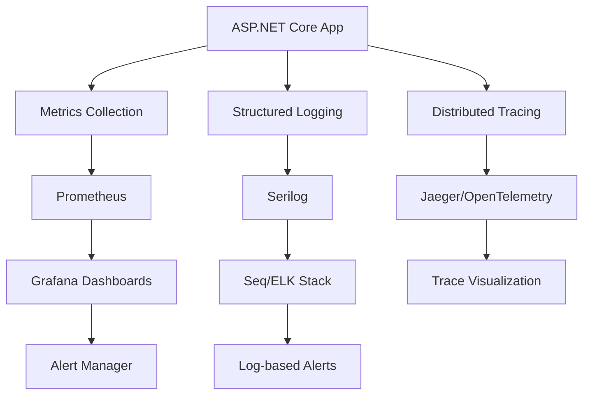

# Advanced Monitoring Guide for ASP.NET Core Performance

## Overview

This guide provides comprehensive monitoring strategies for ASP.NET Core applications, covering metrics collection, performance tracking, diagnostics, and alerting. Learn how to implement production-ready monitoring that helps you identify and resolve performance issues proactively.

## Monitoring Architecture

### 1. Three Pillars of Observability

#### Metrics
- **What to measure**: Quantitative data about your application's behavior
- **Examples**: Response times, throughput, error rates, resource utilization

#### Logs
- **What to track**: Discrete events with contextual information
- **Examples**: Request logs, error details, business events

#### Traces
- **What to follow**: Request flow through distributed systems
- **Examples**: Database calls, external API calls, cache operations

### 2. Monitoring Stack Overview



## Metrics Collection Implementation

### 1. Built-in .NET Metrics

#### System.Diagnostics.Metrics API
```csharp
public class PerformanceMetrics
{
    private static readonly Meter Meter = new("MyApp.Performance", "1.0.0");
    
    // Counters for counting events
    private static readonly Counter<long> RequestsTotal = 
        Meter.CreateCounter<long>("http_requests_total", "requests", "Total HTTP requests");
    
    private static readonly Counter<long> DatabaseQueries = 
        Meter.CreateCounter<long>("database_queries_total", "queries", "Total database queries");
    
    // Histograms for measuring distributions
    private static readonly Histogram<double> RequestDuration = 
        Meter.CreateHistogram<double>("http_request_duration", "ms", "HTTP request duration");
    
    private static readonly Histogram<double> DatabaseQueryDuration = 
        Meter.CreateHistogram<double>("database_query_duration", "ms", "Database query duration");
    
    // Gauges for current values
    private static readonly ObservableGauge<int> ActiveConnections = 
        Meter.CreateObservableGauge<int>("active_connections", "connections", "Active database connections");
    
    // UpDownCounters for values that can increase or decrease
    private static readonly UpDownCounter<int> CurrentUsers = 
        Meter.CreateUpDownCounter<int>("current_users", "users", "Currently logged-in users");

    public static void RecordRequest(string method, string path, int statusCode, double durationMs)
    {
        var tags = new TagList
        {
            ["method"] = method,
            ["path"] = path,
            ["status_code"] = statusCode.ToString()
        };
        
        RequestsTotal.Add(1, tags);
        RequestDuration.Record(durationMs, tags);
    }

    public static void RecordDatabaseQuery(string operation, string table, double durationMs)
    {
        var tags = new TagList
        {
            ["operation"] = operation,
            ["table"] = table
        };
        
        DatabaseQueries.Add(1, tags);
        DatabaseQueryDuration.Record(durationMs, tags);
    }

    public static void RecordUserLogin() => CurrentUsers.Add(1);
    public static void RecordUserLogout() => CurrentUsers.Add(-1);
}
```

#### Metrics Middleware
```csharp
public class MetricsMiddleware
{
    private readonly RequestDelegate _next;
    private readonly ILogger<MetricsMiddleware> _logger;

    public MetricsMiddleware(RequestDelegate next, ILogger<MetricsMiddleware> logger)
    {
        _next = next;
        _logger = logger;
    }

    public async Task InvokeAsync(HttpContext context)
    {
        var stopwatch = Stopwatch.StartNew();
        
        try
        {
            await _next(context);
        }
        finally
        {
            stopwatch.Stop();
            
            PerformanceMetrics.RecordRequest(
                context.Request.Method,
                context.Request.Path.Value ?? "unknown",
                context.Response.StatusCode,
                stopwatch.Elapsed.TotalMilliseconds
            );
        }
    }
}

// Register in Program.cs
app.UseMiddleware<MetricsMiddleware>();
```

### 2. Custom Business Metrics

#### E-commerce Metrics Example
```csharp
public class ECommerceMetrics
{
    private static readonly Meter Meter = new("ECommerce.Business", "1.0.0");
    
    private static readonly Counter<long> OrdersTotal = 
        Meter.CreateCounter<long>("orders_total", "orders", "Total orders");
    
    private static readonly Counter<decimal> RevenueTotal = 
        Meter.CreateCounter<decimal>("revenue_total", "currency", "Total revenue");
    
    private static readonly Histogram<double> OrderValue = 
        Meter.CreateHistogram<double>("order_value", "currency", "Order value distribution");
    
    private static readonly ObservableGauge<int> ProductsInStock = 
        Meter.CreateObservableGauge<int>("products_in_stock", "products", "Products currently in stock");

    public static void RecordOrder(decimal amount, string paymentMethod, string region)
    {
        var tags = new TagList
        {
            ["payment_method"] = paymentMethod,
            ["region"] = region
        };
        
        OrdersTotal.Add(1, tags);
        RevenueTotal.Add(amount, tags);
        OrderValue.Record((double)amount, tags);
    }

    public static void RecordProductPurchase(string productCategory, int quantity)
    {
        var tags = new TagList { ["category"] = productCategory };
        
        var productsSold = Meter.CreateCounter<int>("products_sold_total", "products", "Products sold");
        productsSold.Add(quantity, tags);
    }
}
```

### 3. Database Metrics with EF Core

#### EF Core Interceptor for Metrics
```csharp
public class DatabaseMetricsInterceptor : DbCommandInterceptor
{
    public override ValueTask<InterceptionResult<DbDataReader>> ReaderExecutingAsync(
        DbCommand command, 
        CommandEventData eventData, 
        InterceptionResult<DbDataReader> result,
        CancellationToken cancellationToken = default)
    {
        command.CommandTimeout = 30;
        return base.ReaderExecutingAsync(command, eventData, result, cancellationToken);
    }

    public override ValueTask<DbDataReader> ReaderExecutedAsync(
        DbCommand command, 
        CommandExecutedEventData eventData, 
        DbDataReader result,
        CancellationToken cancellationToken = default)
    {
        var operation = GetOperationType(command.CommandText);
        var table = ExtractTableName(command.CommandText);
        
        PerformanceMetrics.RecordDatabaseQuery(
            operation, 
            table, 
            eventData.Duration.TotalMilliseconds
        );

        if (eventData.Duration.TotalMilliseconds > 1000)
        {
            using var activity = Activity.Current;
            activity?.SetTag("db.slow_query", "true");
            activity?.SetTag("db.duration_ms", eventData.Duration.TotalMilliseconds);
        }

        return base.ReaderExecutedAsync(command, eventData, result, cancellationToken);
    }

    private static string GetOperationType(string sql)
    {
        var trimmed = sql.TrimStart().ToLowerInvariant();
        return trimmed.Split(' ')[0] switch
        {
            "select" => "SELECT",
            "insert" => "INSERT", 
            "update" => "UPDATE",
            "delete" => "DELETE",
            _ => "OTHER"
        };
    }

    private static string ExtractTableName(string sql)
    {
        var patterns = new[]
        {
            @"FROM\s+(\w+)",
            @"INSERT\s+INTO\s+(\w+)",
            @"UPDATE\s+(\w+)",
            @"DELETE\s+FROM\s+(\w+)"
        };

        foreach (var pattern in patterns)
        {
            var match = Regex.Match(sql, pattern, RegexOptions.IgnoreCase);
            if (match.Success)
                return match.Groups[1].Value;
        }

        return "unknown";
    }
}
```

## Structured Logging Implementation

### 1. Serilog Configuration

#### Advanced Serilog Setup
```csharp
// Program.cs
Log.Logger = new LoggerConfiguration()
    .MinimumLevel.Information()
    .MinimumLevel.Override("Microsoft", LogEventLevel.Warning)
    .MinimumLevel.Override("Microsoft.Hosting.Lifetime", LogEventLevel.Information)
    .Enrich.FromLogContext()
    .Enrich.WithMachineName()
    .Enrich.WithEnvironmentName()
    .Enrich.WithProperty("Application", "MyApp")
    .WriteTo.Console(new JsonFormatter())
    .WriteTo.File(
        new JsonFormatter(),
        "logs/app-.log",
        rollingInterval: RollingInterval.Day,
        retainedFileCountLimit: 30)
    .WriteTo.Seq("http://localhost:5341")
    .CreateLogger();

builder.Host.UseSerilog();

app.UseSerilogRequestLogging(options =>
{
    options.MessageTemplate = "HTTP {RequestMethod} {RequestPath} responded {StatusCode} in {Elapsed:0.0000} ms";
    options.EnrichDiagnosticContext = (diagnosticContext, httpContext) =>
    {
        diagnosticContext.Set("RequestHost", httpContext.Request.Host.Value);
        diagnosticContext.Set("RequestScheme", httpContext.Request.Scheme);
        diagnosticContext.Set("UserAgent", httpContext.Request.Headers["User-Agent"].FirstOrDefault());
        
        if (httpContext.User.Identity?.IsAuthenticated == true)
        {
            diagnosticContext.Set("UserName", httpContext.User.Identity.Name);
        }
    };
});
```

### 2. High-Performance Logging Patterns

#### LoggerMessage for Performance
```csharp
public static partial class LogMessages
{
    [LoggerMessage(
        EventId = 1001,
        Level = LogLevel.Information,
        Message = "Processing order {OrderId} for customer {CustomerId}")]
    public static partial void ProcessingOrder(ILogger logger, int orderId, int customerId);

    [LoggerMessage(
        EventId = 1002,
        Level = LogLevel.Warning,
        Message = "Slow database query detected: {Duration}ms for operation {Operation}")]
    public static partial void SlowQuery(ILogger logger, double duration, string operation);

    [LoggerMessage(
        EventId = 1003,
        Level = LogLevel.Error,
        Message = "Payment processing failed for order {OrderId}: {ErrorMessage}")]
    public static partial void PaymentFailed(ILogger logger, int orderId, string errorMessage, Exception ex);
}
```

## Distributed Tracing Implementation

### 1. OpenTelemetry Configuration

#### Complete OpenTelemetry Setup
```csharp
// Program.cs
services.AddOpenTelemetry()
    .WithTracing(builder =>
    {
        builder
            .AddSource("MyApp.*")
            .SetSampler(new TraceIdRatioBasedSampler(1.0))
            .AddAspNetCoreInstrumentation(options =>
            {
                options.RecordException = true;
                options.EnrichWithHttpRequest = (activity, request) =>
                {
                    activity.SetTag("http.request.body.size", request.ContentLength ?? 0);
                    activity.SetTag("http.user_agent", request.Headers.UserAgent.ToString());
                };
            })
            .AddEntityFrameworkCoreInstrumentation()
            .AddHttpClientInstrumentation()
            .AddRedisInstrumentation()
            .AddJaegerExporter()
            .AddOtlpExporter();
    })
    .WithMetrics(builder =>
    {
        builder
            .AddMeter("MyApp.*")
            .AddAspNetCoreInstrumentation()
            .AddHttpClientInstrumentation()
            .AddRuntimeInstrumentation()
            .AddPrometheusExporter();
    });

public static class ActivitySources
{
    public static readonly ActivitySource Orders = new("MyApp.Orders", "1.0.0");
    public static readonly ActivitySource Payments = new("MyApp.Payments", "1.0.0");
    public static readonly ActivitySource Inventory = new("MyApp.Inventory", "1.0.0");
}
```

## Application Performance Monitoring (APM)

### 1. Application Insights Integration

#### Comprehensive Application Insights Setup
```csharp
builder.Services.AddApplicationInsightsTelemetry(options =>
{
    options.ConnectionString = builder.Configuration.GetConnectionString("ApplicationInsights");
    options.DeveloperMode = builder.Environment.IsDevelopment();
});

builder.Services.AddSingleton<ITelemetryInitializer, CustomTelemetryInitializer>();

public class CustomTelemetryInitializer : ITelemetryInitializer
{
    public void Initialize(ITelemetry telemetry)
    {
        telemetry.Context.GlobalProperties["Environment"] = Environment.GetEnvironmentVariable("ASPNETCORE_ENVIRONMENT") ?? "Unknown";
        telemetry.Context.GlobalProperties["MachineName"] = Environment.MachineName;
        telemetry.Context.GlobalProperties["ApplicationVersion"] = Assembly.GetEntryAssembly()?.GetCustomAttribute<AssemblyInformationalVersionAttribute>()?.InformationalVersion ?? "Unknown";
    }
}
```

### 2. Health Checks Implementation

#### Comprehensive Health Checks
```csharp
services.AddHealthChecks()
    .AddCheck<DatabaseHealthCheck>("database")
    .AddCheck<RedisHealthCheck>("redis")
    .AddCheck<ExternalApiHealthCheck>("external-api")
    .AddCheck<MemoryHealthCheck>("memory");

app.MapHealthChecks("/health", new HealthCheckOptions
{
    ResponseWriter = UIResponseWriter.WriteHealthCheckUIResponse,
    ResultStatusCodes =
    {
        [HealthStatus.Healthy] = StatusCodes.Status200OK,
        [HealthStatus.Degraded] = StatusCodes.Status200OK,
        [HealthStatus.Unhealthy] = StatusCodes.Status503ServiceUnavailable
    }
});

public class MemoryHealthCheck : IHealthCheck
{
    public Task<HealthCheckResult> CheckHealthAsync(HealthCheckContext context, CancellationToken cancellationToken = default)
    {
        var allocatedBytes = GC.GetTotalMemory(false);
        var workingSet = Environment.WorkingSet;
        
        var data = new Dictionary<string, object>
        {
            ["AllocatedMemory"] = FormatBytes(allocatedBytes),
            ["WorkingSet"] = FormatBytes(workingSet),
            ["Gen0Collections"] = GC.CollectionCount(0),
            ["Gen1Collections"] = GC.CollectionCount(1),
            ["Gen2Collections"] = GC.CollectionCount(2)
        };

        const long maxMemory = 1_073_741_824; // 1GB
        var memoryUsagePercentage = (double)workingSet / maxMemory * 100;

        if (memoryUsagePercentage > 90)
        {
            return Task.FromResult(HealthCheckResult.Unhealthy($"High memory usage: {memoryUsagePercentage:F1}%", data: data));
        }

        if (memoryUsagePercentage > 80)
        {
            return Task.FromResult(HealthCheckResult.Degraded($"Elevated memory usage: {memoryUsagePercentage:F1}%", data: data));
        }

        return Task.FromResult(HealthCheckResult.Healthy("Memory usage is normal", data));
    }

    private static string FormatBytes(long bytes)
    {
        const long kb = 1024;
        const long mb = kb * 1024;
        const long gb = mb * 1024;

        return bytes switch
        {
            >= gb => $"{bytes / gb:F1} GB",
            >= mb => $"{bytes / mb:F1} MB",
            >= kb => $"{bytes / kb:F1} KB",
            _ => $"{bytes} B"
        };
    }
}
```

## Alert Configuration

### 1. Metrics-Based Alerts

#### Grafana Alert Rules
```yaml
groups:
  - name: aspnet-core-performance
    rules:
      - alert: HighResponseTime
        expr: histogram_quantile(0.95, rate(http_request_duration_seconds_bucket[5m])) > 0.5
        for: 2m
        labels:
          severity: warning
          service: aspnet-core
        annotations:
          summary: "High response time detected"
          description: "95th percentile response time is {{ $value }}s for the last 5 minutes"

      - alert: HighErrorRate
        expr: rate(http_requests_total{status=~"5.."}[5m]) / rate(http_requests_total[5m]) > 0.05
        for: 1m
        labels:
          severity: critical
          service: aspnet-core
        annotations:
          summary: "High error rate detected"
          description: "Error rate is {{ $value | humanizePercentage }} for the last 5 minutes"

      - alert: DatabaseConnectionPoolExhaustion
        expr: database_connections_active / database_connections_max > 0.8
        for: 1m
        labels:
          severity: warning
          service: database
        annotations:
          summary: "Database connection pool nearly exhausted"
          description: "{{ $value | humanizePercentage }} of database connections are in use"

      - alert: HighMemoryUsage
        expr: process_working_set_bytes / (1024*1024*1024) > 0.8
        for: 5m
        labels:
          severity: warning
          service: aspnet-core
        annotations:
          summary: "High memory usage detected"
          description: "Application is using {{ $value | humanize }}GB of memory"
```

### 2. Log-Based Alerts

#### Seq Alert Configuration
```sql
-- Alert: High Error Rate
SELECT COUNT(*) as ErrorCount
FROM stream 
WHERE @Level = 'Error' 
AND @Timestamp >= Now() - 5m
HAVING ErrorCount > 10

-- Alert: Slow Database Queries
SELECT COUNT(*) as SlowQueryCount
FROM stream 
WHERE @MessageTemplate LIKE '%Slow query detected%'
AND @Timestamp >= Now() - 5m
HAVING SlowQueryCount > 5

-- Alert: Payment Failures
SELECT COUNT(*) as PaymentFailureCount
FROM stream 
WHERE @MessageTemplate LIKE '%Payment processing failed%'
AND @Timestamp >= Now() - 10m
HAVING PaymentFailureCount > 3
```

## Performance Dashboards

### 1. Grafana Dashboard Configuration

#### JSON Dashboard Configuration
```json
{
  "dashboard": {
    "title": "ASP.NET Core Performance",
    "panels": [
      {
        "title": "Request Rate",
        "type": "graph",
        "targets": [
          {
            "expr": "rate(http_requests_total[5m])",
            "legendFormat": "{{method}} {{path}}"
          }
        ]
      },
      {
        "title": "Response Time Percentiles",
        "type": "graph",
        "targets": [
          {
            "expr": "histogram_quantile(0.50, rate(http_request_duration_seconds_bucket[5m]))",
            "legendFormat": "50th percentile"
          },
          {
            "expr": "histogram_quantile(0.95, rate(http_request_duration_seconds_bucket[5m]))",
            "legendFormat": "95th percentile"
          },
          {
            "expr": "histogram_quantile(0.99, rate(http_request_duration_seconds_bucket[5m]))",
            "legendFormat": "99th percentile"
          }
        ]
      },
      {
        "title": "Error Rate",
        "type": "singlestat",
        "targets": [
          {
            "expr": "rate(http_requests_total{status=~\"5..\"}[5m]) / rate(http_requests_total[5m]) * 100",
            "legendFormat": "Error Rate %"
          }
        ],
        "thresholds": "1,5",
        "colorBackground": true
      }
    ]
  }
}
```

## Production Monitoring Best Practices

### 1. Monitoring Strategy

- **Golden Signals**: Latency, Traffic, Errors, Saturation
- **SLIs/SLOs**: Define Service Level Indicators and Objectives
- **Error Budgets**: Balance feature velocity with reliability
- **Runbooks**: Document response procedures for alerts

### 2. Performance Baselines

```csharp
public class PerformanceBaselines
{
    public static class ApiEndpoints
    {
        public const double GetProductsP95Ms = 200; // 95th percentile under 200ms
        public const double CreateOrderP95Ms = 500; // Order creation under 500ms
        public const double SearchProductsP95Ms = 300; // Search under 300ms
    }

    public static class DatabaseQueries
    {
        public const double SimpleQueryP95Ms = 50; // Simple queries under 50ms
        public const double ComplexQueryP95Ms = 200; // Complex queries under 200ms
        public const double ReportQueryP95Ms = 2000; // Report queries under 2s
    }

    public static class BusinessMetrics
    {
        public const double ErrorRateThreshold = 0.01; // 1% error rate
        public const int MinOrdersPerHour = 100; // Minimum expected orders
        public const double CacheHitRateThreshold = 0.8; // 80% cache hit rate
    }
}
```

### 3. Monitoring Checklist

✅ **Infrastructure Metrics**
- CPU, Memory, Disk, Network utilization
- Container resource usage (if using Docker/Kubernetes)
- Load balancer metrics

✅ **Application Metrics**
- Request rate, response time, error rate
- Database connection pool usage
- Cache hit/miss ratios
- Background job processing

✅ **Business Metrics**
- Order volume, revenue
- User engagement metrics
- Feature usage statistics
- Conversion rates

✅ **Security Metrics**
- Failed login attempts
- Suspicious activity patterns
- Certificate expiration dates

✅ **Operational Metrics**
- Deployment frequency
- Lead time for changes
- Mean time to recovery (MTTR)
- Change failure rate

## Summary

Effective monitoring requires:

1. **Comprehensive Coverage**: Metrics, logs, and traces working together
2. **Actionable Alerts**: Alerts that require human intervention
3. **Performance Baselines**: Known good performance levels
4. **Business Alignment**: Monitoring what matters to the business
5. **Continuous Improvement**: Regular review and optimization of monitoring

**Remember**: Monitor early, alert wisely, and always measure the impact of your optimizations.
