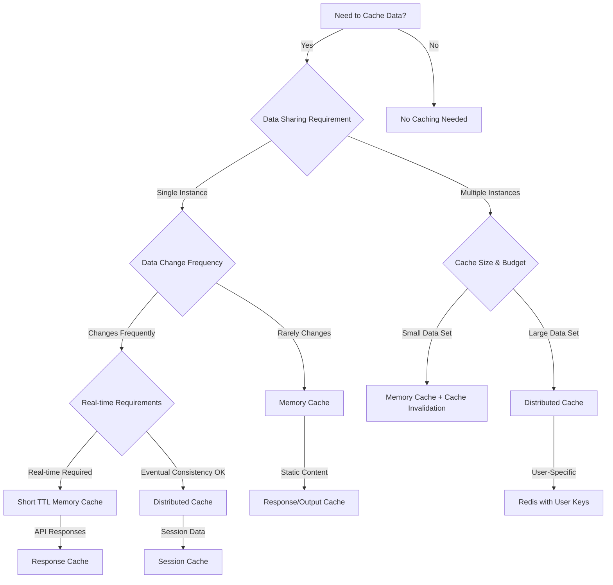

# Caching Decision Guide for ASP.NET Core

## Overview

Choosing the right caching strategy is crucial for application performance. This guide helps you make informed decisions about when and how to implement different caching approaches in your ASP.NET Core applications.

## Decision Tree



## Caching Strategies Matrix

| Scenario | Recommended Strategy | Implementation | TTL | Considerations |
|----------|---------------------|----------------|-----|----------------|
| **Static Content** | Output Cache + CDN | `[OutputCache]` | Hours/Days | Browser caching, ETags |
| **API Data (Read-Heavy)** | Memory Cache | `IMemoryCache` | 5-30 min | Single instance only |
| **Database Query Results** | Memory + Distributed | Hybrid approach | 10-60 min | Cache invalidation needed |
| **User Sessions** | Distributed Cache | Redis/SQL Server | Session length | Scale across instances |
| **Computed Results** | Memory Cache | `IMemoryCache` | 15-60 min | CPU vs Memory trade-off |
| **Configuration Data** | Memory Cache | `IMemoryCache` | Hours | Reload on change |
| **Large Objects** | Distributed Cache | Redis with compression | Variable | Memory efficiency |

## Memory Cache vs Distributed Cache

### Use Memory Cache When:
- ✅ **Single instance deployment**
- ✅ **Low latency requirements** (< 1ms access time)
- ✅ **Frequently accessed small objects** (< 10MB total)
- ✅ **Data doesn't need sharing between instances**
- ✅ **Simple invalidation requirements**

**Implementation:**
```csharp
services.AddMemoryCache(options =>
{
    options.SizeLimit = 100; // Limit cache size
    options.CompactionPercentage = 0.25; // Remove 25% when full
});

// Usage
_cache.Set(key, value, new MemoryCacheEntryOptions
{
    Size = 1,
    SlidingExpiration = TimeSpan.FromMinutes(5),
    AbsoluteExpirationRelativeToNow = TimeSpan.FromHours(1),
    Priority = CacheItemPriority.High
});
```

### Use Distributed Cache When:
- ✅ **Multiple instances/load balancing**
- ✅ **Large data sets** (> 10MB)
- ✅ **Data needs to survive app restarts**
- ✅ **Cross-service data sharing**
- ✅ **Session state management**

**Implementation:**
```csharp
services.AddStackExchangeRedisCache(options =>
{
    options.Configuration = "localhost:6379";
    options.InstanceName = "MyApp";
});

// Usage with JSON serialization
public async Task<T?> GetAsync<T>(string key)
{
    var cachedValue = await _distributedCache.GetStringAsync(key);
    return cachedValue == null ? default : JsonSerializer.Deserialize<T>(cachedValue);
}
```

## Response Caching Strategies

### HTTP Response Caching
**Best for:** Static or semi-static content that doesn't vary by user

```csharp
[ResponseCache(Duration = 3600, VaryByQueryKeys = new[] { "category", "page" })]
public async Task<IActionResult> GetProducts(string category, int page = 1)
{
    // Implementation
}
```

### Output Caching (New in .NET 8)
**Best for:** Dynamic content with complex cache invalidation needs

```csharp
services.AddOutputCache(options =>
{
    options.AddPolicy("Products", builder => 
        builder.Tag("products")
               .Expire(TimeSpan.FromMinutes(10))
               .VaryByQuery("category", "page"));
});

[OutputCache(PolicyName = "Products")]
public async Task<IActionResult> GetProducts() { }

// Invalidation
await _outputCacheStore.EvictByTagAsync("products", cancellationToken);
```

## Cache Invalidation Patterns

### 1. Time-Based Expiration
**When to use:** Data has predictable change patterns
```csharp
_cache.Set(key, value, TimeSpan.FromMinutes(30));
```

### 2. Event-Based Invalidation
**When to use:** Data changes are triggered by specific events
```csharp
public async Task UpdateProduct(Product product)
{
    await _repository.UpdateAsync(product);
    
    // Invalidate related caches
    _cache.Remove($"product_{product.Id}");
    _cache.Remove("all_products");
    await _outputCacheStore.EvictByTagAsync("products", default);
}
```

### 3. Version-Based Invalidation
**When to use:** Need to coordinate cache invalidation across services
```csharp
public class VersionedCacheKey
{
    public string Key { get; set; }
    public int Version { get; set; }
    
    public override string ToString() => $"{Key}:v{Version}";
}
```

### 4. Cache Tags (Output Cache)
**When to use:** Need to invalidate groups of related cached items
```csharp
[OutputCache(Tags = new[] { "products", $"category:{categoryId}" })]
public async Task<IActionResult> GetProductsByCategory(int categoryId) { }

// Invalidate all products in a category
await _outputCacheStore.EvictByTagAsync($"category:{categoryId}", default);
```

## Performance Considerations

### Cache Key Design
**Good Practice:**
```csharp
// Hierarchical naming
"user:123:profile"
"product:456:details"
"category:789:products:page:2"

// Include version for schema changes
"product:456:v2"
```

**Avoid:**
```csharp
// Non-descriptive keys
"cache1", "temp", "data"

// Keys that are too long
"this_is_a_very_long_cache_key_that_wastes_memory_and_network_bandwidth"
```

### Memory Management
```csharp
// Configure memory cache with size tracking
services.AddMemoryCache(options =>
{
    options.SizeLimit = 1000;
    options.TrackLinkedCacheEntries = false; // For performance
});

// Set size for cache entries
_cache.Set(key, value, new MemoryCacheEntryOptions
{
    Size = CalculateSize(value), // Implement size calculation
    Priority = CacheItemPriority.Normal
});
```

### Serialization Performance
```csharp
// Use efficient serialization for distributed cache
public class JsonCacheSerializer
{
    private static readonly JsonSerializerOptions Options = new()
    {
        PropertyNamingPolicy = JsonNamingPolicy.CamelCase,
        DefaultIgnoreCondition = JsonIgnoreCondition.WhenWritingNull
    };
    
    public static byte[] Serialize<T>(T value)
    {
        return JsonSerializer.SerializeToUtf8Bytes(value, Options);
    }
    
    public static T? Deserialize<T>(byte[] data)
    {
        return JsonSerializer.Deserialize<T>(data, Options);
    }
}

// Consider MessagePack for better performance
// Install-Package MessagePack
```

## Multi-Level Caching Implementation

### L1 (Memory) + L2 (Distributed) Pattern
```csharp
public class HybridCacheService : ICacheService
{
    private readonly IMemoryCache _memoryCache;
    private readonly IDistributedCache _distributedCache;
    private readonly ILogger<HybridCacheService> _logger;
    
    public async Task<T?> GetAsync<T>(string key)
    {
        // Try L1 cache first
        if (_memoryCache.TryGetValue(key, out T? value))
        {
            _logger.LogDebug("Cache hit (L1): {Key}", key);
            return value;
        }
        
        // Try L2 cache
        var distributedValue = await _distributedCache.GetAsync(key);
        if (distributedValue != null)
        {
            value = JsonCacheSerializer.Deserialize<T>(distributedValue);
            if (value != null)
            {
                // Store in L1 cache for faster access
                _memoryCache.Set(key, value, TimeSpan.FromMinutes(5));
                _logger.LogDebug("Cache hit (L2): {Key}", key);
                return value;
            }
        }
        
        _logger.LogDebug("Cache miss: {Key}", key);
        return default;
    }
    
    public async Task SetAsync<T>(string key, T value, TimeSpan? expiry = null)
    {
        // Set in both caches
        var options = new MemoryCacheEntryOptions();
        var distributedOptions = new DistributedCacheEntryOptions();
        
        if (expiry.HasValue)
        {
            options.AbsoluteExpirationRelativeToNow = expiry;
            distributedOptions.AbsoluteExpirationRelativeToNow = expiry;
        }
        
        _memoryCache.Set(key, value, options);
        await _distributedCache.SetAsync(key, JsonCacheSerializer.Serialize(value), distributedOptions);
    }
}
```

## Cache Warming Strategies

### Application Startup Warming
```csharp
public class CacheWarmupService : IHostedService
{
    private readonly ICacheService _cache;
    private readonly IProductService _productService;
    
    public async Task StartAsync(CancellationToken cancellationToken)
    {
        // Warm up frequently accessed data
        var popularProducts = await _productService.GetPopularProductsAsync();
        foreach (var product in popularProducts)
        {
            await _cache.SetAsync($"product_{product.Id}", product, TimeSpan.FromHours(1));
        }
        
        // Warm up configuration data
        var categories = await _productService.GetCategoriesAsync();
        await _cache.SetAsync("categories", categories, TimeSpan.FromHours(6));
    }
    
    public Task StopAsync(CancellationToken cancellationToken) => Task.CompletedTask;
}
```

### Background Refresh Pattern
```csharp
public class BackgroundCacheRefreshService : BackgroundService
{
    protected override async Task ExecuteAsync(CancellationToken stoppingToken)
    {
        while (!stoppingToken.IsCancellationRequested)
        {
            try
            {
                await RefreshExpensiveData();
                await Task.Delay(TimeSpan.FromMinutes(30), stoppingToken);
            }
            catch (Exception ex)
            {
                _logger.LogError(ex, "Error refreshing cache");
            }
        }
    }
    
    private async Task RefreshExpensiveData()
    {
        // Refresh data that's expensive to compute
        var statistics = await _analyticsService.GetDashboardStatisticsAsync();
        await _cache.SetAsync("dashboard_stats", statistics, TimeSpan.FromHours(1));
    }
}
```

## Monitoring and Metrics

### Cache Hit Rate Monitoring
```csharp
public class CacheMetricsService
{
    private readonly IMetrics _metrics;
    private readonly Counter<int> _cacheHits;
    private readonly Counter<int> _cacheMisses;
    
    public CacheMetricsService(IMeterFactory meterFactory)
    {
        var meter = meterFactory.Create("App.Cache");
        _cacheHits = meter.CreateCounter<int>("cache_hits");
        _cacheMisses = meter.CreateCounter<int>("cache_misses");
    }
    
    public void RecordHit(string cacheType) => _cacheHits.Add(1, new TagList { ["type"] = cacheType });
    public void RecordMiss(string cacheType) => _cacheMisses.Add(1, new TagList { ["type"] = cacheType });
}
```

### Cache Performance Logging
```csharp
public class InstrumentedCacheService : ICacheService
{
    private readonly ICacheService _innerService;
    private readonly ILogger<InstrumentedCacheService> _logger;
    private readonly CacheMetricsService _metrics;
    
    public async Task<T?> GetAsync<T>(string key)
    {
        using var activity = Activity.StartActivity("Cache.Get");
        activity?.SetTag("cache.key", key);
        
        var stopwatch = Stopwatch.StartNew();
        var result = await _innerService.GetAsync<T>(key);
        stopwatch.Stop();
        
        var hit = result != null;
        activity?.SetTag("cache.hit", hit);
        
        if (hit)
        {
            _metrics.RecordHit("distributed");
            _logger.LogDebug("Cache hit for {Key} in {Duration}ms", key, stopwatch.ElapsedMilliseconds);
        }
        else
        {
            _metrics.RecordMiss("distributed");
            _logger.LogDebug("Cache miss for {Key} in {Duration}ms", key, stopwatch.ElapsedMilliseconds);
        }
        
        return result;
    }
}
```

## Common Caching Anti-Patterns

### ❌ Avoid These Patterns:

**1. Cache Everything**
```csharp
// BAD - Caching data that changes frequently
_cache.Set("current_time", DateTime.Now, TimeSpan.FromHours(1));
```

**2. Ignoring Cache Size**
```csharp
// BAD - No size limits or management
_cache.Set(key, largeObject); // Could cause OutOfMemoryException
```

**3. Not Handling Cache Misses**
```csharp
// BAD - Assuming cache always has data
var product = _cache.Get<Product>(key); // Could be null!
return product.Name; // NullReferenceException
```

**4. Circular Cache Dependencies**
```csharp
// BAD - Service A depends on cache of Service B, which depends on cache of Service A
```

**5. Not Considering Cache Stampede**
```csharp
// BAD - Multiple threads computing the same expensive operation
public async Task<ExpensiveData> GetExpensiveDataAsync(string key)
{
    var cached = await _cache.GetAsync<ExpensiveData>(key);
    if (cached == null)
    {
        // Multiple threads might execute this expensive operation simultaneously
        cached = await ComputeExpensiveDataAsync();
        await _cache.SetAsync(key, cached);
    }
    return cached;
}

// GOOD - Use SemaphoreSlim or similar to prevent cache stampede
private readonly SemaphoreSlim _semaphore = new(1, 1);

public async Task<ExpensiveData> GetExpensiveDataAsync(string key)
{
    var cached = await _cache.GetAsync<ExpensiveData>(key);
    if (cached != null) return cached;
    
    await _semaphore.WaitAsync();
    try
    {
        // Double-check pattern
        cached = await _cache.GetAsync<ExpensiveData>(key);
        if (cached == null)
        {
            cached = await ComputeExpensiveDataAsync();
            await _cache.SetAsync(key, cached);
        }
        return cached;
    }
    finally
    {
        _semaphore.Release();
    }
}
```

## Testing Caching Logic

### Unit Testing Cache Behavior
```csharp
[Test]
public async Task GetAsync_WhenCacheHit_ShouldReturnCachedValue()
{
    // Arrange
    var mockCache = new Mock<IDistributedCache>();
    var expectedData = new Product { Id = 1, Name = "Test" };
    var serializedData = JsonSerializer.SerializeToUtf8Bytes(expectedData);
    
    mockCache.Setup(x => x.GetAsync("test_key", default))
           .ReturnsAsync(serializedData);
    
    var service = new CacheService(mockCache.Object);
    
    // Act
    var result = await service.GetAsync<Product>("test_key");
    
    // Assert
    result.Should().BeEquivalentTo(expectedData);
    mockCache.Verify(x => x.GetAsync("test_key", default), Times.Once);
}
```

### Integration Testing
```csharp
[Test]
public async Task CacheIntegration_ShouldWorkEndToEnd()
{
    // Use TestContainers for Redis testing
    await using var redis = new RedisBuilder().Build();
    await redis.StartAsync();
    
    var services = new ServiceCollection();
    services.AddStackExchangeRedisCache(options =>
    {
        options.Configuration = redis.GetConnectionString();
    });
    
    var provider = services.BuildServiceProvider();
    var cache = provider.GetService<IDistributedCache>();
    
    // Test cache operations
    await cache.SetStringAsync("test", "value");
    var result = await cache.GetStringAsync("test");
    
    result.Should().Be("value");
}
```

## Production Considerations

### Redis Configuration
```csharp
services.AddStackExchangeRedisCache(options =>
{
    options.Configuration = builder.Configuration.GetConnectionString("Redis");
    options.InstanceName = Environment.GetEnvironmentVariable("ASPNETCORE_ENVIRONMENT");
    
    // Connection pooling
    options.ConfigurationOptions = new ConfigurationOptions
    {
        EndPoints = { "redis-cluster:6379" },
        Password = "your-redis-password",
        ConnectTimeout = 5000,
        SyncTimeout = 5000,
        AbortOnConnectFail = false,
        ConnectRetry = 3,
        KeepAlive = 180
    };
});
```

### Health Checks
```csharp
services.AddHealthChecks()
    .AddCheck<MemoryCacheHealthCheck>("memory_cache")
    .AddRedis(builder.Configuration.GetConnectionString("Redis"));

public class MemoryCacheHealthCheck : IHealthCheck
{
    private readonly IMemoryCache _cache;
    
    public async Task<HealthCheckResult> CheckHealthAsync(HealthCheckContext context, CancellationToken cancellationToken = default)
    {
        try
        {
            var testKey = "health_check_test";
            _cache.Set(testKey, "test", TimeSpan.FromSeconds(10));
            var result = _cache.Get(testKey);
            
            return result != null 
                ? HealthCheckResult.Healthy("Memory cache is working") 
                : HealthCheckResult.Unhealthy("Memory cache test failed");
        }
        catch (Exception ex)
        {
            return HealthCheckResult.Unhealthy("Memory cache error", ex);
        }
    }
}
```

## Summary

Choose your caching strategy based on:

1. **Deployment Model**: Single instance → Memory Cache, Multiple instances → Distributed Cache
2. **Data Characteristics**: Size, change frequency, access patterns
3. **Performance Requirements**: Latency, throughput, consistency
4. **Infrastructure**: Available services, budget, maintenance

Remember: **Measure first, optimize second, and always monitor your cache effectiveness in production.**
